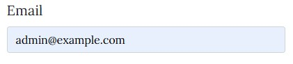
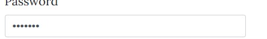
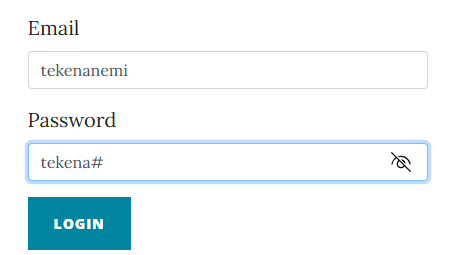
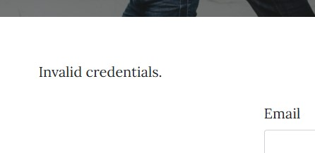
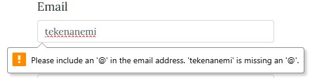
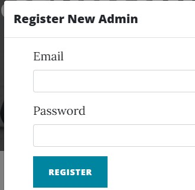
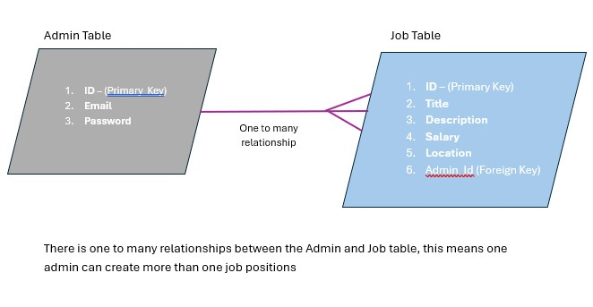

## Table of Contents
1. [Introduction](#introduction)
2. [Features](#features)
3. [UX](#ux) 
4. [Installation](#installation)
5. [Usage](#usage)
6. [Routes](#routes)
7. [Testing](#testing)
8. [Known bugs](#known-bugs)
9. [Deployment](#deployment)
10. [Admin Dashboard](#admin-dashboard)
11. [Tables](#tables)
12. [Future improvements](#future-improvements)
13. [Wireframes](#wireframes)
14. [Index](#index)
15. [Career Page](#career-page)
16. [Admin Login](#admin-login)
17. [Acknowledgements](#acknowledgements)
18. [Contact](#contact)


## Introduction
Parenting.com is a website for parents needs whilst boosting an admin login for CRUD operations on the career page.


## Features
- Homepage
- Admin login/logout
- Career page
- Job posting management (CRUD operations)
- Flash messages for success/error notifications
- Secure password handling


## UX
1. As a user, I want to register as an admin so i can post and manage jobs.
- Method: By filling out the registration form.
- Result: User then gets registered as an admin and then able to log in to the admin    dashboard

2. As a user, I want to be navigate to the career page and access new jobs postings if any
- Method: By navigating to the career page 

3. As an admin, I want to log in and out of the admin dashboard so that i can manage job postings.
- Method: Enter the correct username and password on the login page .
- Result: Redirect to the admin dashboard.

4. As an admin, I want to add new jobs to display on the career page.
- Method: By filling out the jobs posting form.
- Expected Result: the job is being added to the carrer page.

5. As a user, I want to update created jobs.
- Method: By modifying the already created jobs form.
- Expected Result: the job in career page is updated with new details.

6. As a user, I want to delete a job postings so it gets taken off the career page.
- Method: Click the delete button on a job posting
- Expected Result: job posted gets deleted from career page


## Index
- The home page is designed to give information about the parenting.com and images that relates to subject topic.

## Admin Page
- The admin page enables admin to login and register through the database to the admin dashboard.

## Admin Dashboard
- Once logged in the admin can use the CRUD functionalities to update the career page

## Career Page
- The career page displays Job listings with fine boostrap display styling 

## Technologies
- Python 3.7+
- Flask
- SQLAlchemy
- psycopg2
- Jinja2
- Werkzeug

## Installation
1. **Clone the repository**:
   ```bash
   git clone https://github.com/Nemi100/parentingdb.git
   cd parentingdb

2. **Create and activate virtual environment**:
   python -m venv venv
   venv/bin/activate

3. **Install dependencies**:
   pip install  (Check Requirements)
   pip install -r requirements.txt

## Usage
1. **Run the application**:
   python app.py

2. Access the application and go to your localhost: http://localhost:5000/.

## Routes

- /: Main page
- /career: Careers page displaying job postings
- /admin/login: Admin login page
- /admin/dashboard: Admin dashboard for managing job postings (protected)
- /admin/logout: Admin logout
- /admin/job: Add job posting (POST)
- /admin/job/<int:id>: Modify or delete job posting (POST)


## Testing

## Manuel Testing

1.Admin login:
- At the /admin/login
- valid and invalid credentials can be entered to validate proper data handling

2.Job Postings:
- Loging in will help navigate to /admin/dashboard/
- valid and invalid credentials can be entered to validate proper data handling

### Form Testing
| Element                         | Action        | Expected Result                         | Pass/Fail |
|---------------------------------|---------------|-----------------------------------------|-----------|
| Username                        | Text input    | Text displayed to user                  | Pass      |
| Password                        | Text input    | Password is hidden to user              | Pass      |
| Show password icon              | Click         | Password is unveiled to user            | Pass      |
| Login button (fields correct)   | Click         | Redirect to hidden Admin dashboard                    | Pass      |
| Login button (fields incorrect) | Click         | Input fields requirements are displayed                       | Pass      |
| Error message (unregistered User)|        Click       | Invalid Credentials is displayed                   | Pass      |
| Login button (register)| Click        | Regitration form modal displays | Pass      |
| Logout button | Click        | Reload login page | Pass      |
| Redirect Link 'Register New Admin'    | Click         | Redirect to Register Modal Form              | Pass      |


## Known Bugs
- When a job is edited in the career page the posting admin needs to reflect that as it did when the job was originally created.

## Deployment
-

### The Username visibilty test as displayed below


### Password hidden


### Password display


### Admin login success


### Admin login failure


### Invalid form input


### New Admin Registration


### Admin logout/redirecting to admin login page


### Tables
- Admin: This stores information about administration.
- Job: This stores job postings with reference to the admin who posted them.

### Database Relationship



### Admin Table
| Column Name                     | Data Type     | Constraints          |
|---------------------------------|---------------|----------------------------|
| Id                              | Integer       | Primary Key                |
| email                           | String        | Not Null,Unique            |
| Password                        | String        | Not Null                   |

### Job Table
| Column Name                     | Data Type     | Constraints          |
|---------------------------------|---------------|----------------------------|
| Id                              | Integer       | Primary Key                |
| title                           | String        | Not Null                   |
| description                     | Text          | Not Null                   |
| salary                          | Float         | Nullable                   |
| location                        | String        | Nullable                   |
| admin_id                        | Integer       | Foreign Key(admin.id)      |

### Table Relationship
- Admin: One admin can post multiple jobs
- Job  : Each job is posted by one admin

## Future Improvements
-  This website will need an about us page 
-  A user register form and dashboard for specific updates 
## Wireframes
- Old fashioned and would rather hold a pen to sketch these 
- admin dashboard wireframe

- career page wireframe

- Home page wireframe

- Admin Login wireframe


## Index
- The home page is detailed but straight foward approach to announce what parenting.com has to offer.
- The simplicity and contrast between black text color and white background keeps the focus of users on the contents.

## Career
- The career page just like the home page simplicity keeps the focus on the users on the contents.
## Admin Login
- The uniformity across the pages in color was my desired goal besides the contents of each page.here in the admin login page is an admin form and a register new admin button which leads to a modal form .
## Admin Dasboard
- Although hidden and only revealed when admin login has been authenticated also has the same design like the rest of the pages but most importantly displays the CRUD functionality which results gets displayed in the career page.
## Acknowledgements

We would like to thank the following individuals and organizations for their contributions to this project:

 - [Parwiz Forogh](https://www.youtube.com/watch?v=Pu9XhFJduEw&t=2s)
 - [Awesome README](https://github.com/matiassingers/awesome-readme)
 - [TechWithGio](https://www.youtube.com/watch?v=OLsVfmjEpSc&t=95s)
 - [Pexels Images](https://www.pexels.com/search/concert/)
 - [Code Institute Flask framework](https://www.youtube.com/watch?v=Semy2AHoclk)

 - [Parwiz Forogh](https://www.youtube.com/watch?v=XTpLbBJTOM4&t=276s)


## Contact
- **For any questions, please contact**:
   Name: Tekena Nemi

- Email: teksity@gmail.com

     

