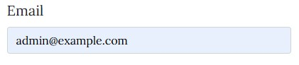
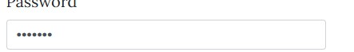

## Table of Contents
1. [Introduction](#introduction)
2. [Features](#features)
3. [Requirements](#requirements)
4. [Installation](#installation)
5. [Usage](#usage)
6. [Routes](#routes)
7. [Testing](#testing)
8. [Deployment](#deployment)
9. [admin_dashboard](#admin_dashboard)
10. [base](#base)
11. [index](#index)
12. [career](#career)
13. [admin_login](#admin_login)
14. [Contributing](#contributing)
15. [Contact](#contact)

## Introduction
A website for parents boosting an admin login for CRUD operations on the career page.


## Features
- Homepage
- Admin login/logout
- Career page
- Job posting management (CRUD operations)
- Flash messages for success/error notifications
- Secure password handling

## Homepage
- The home page is designed to give information about the parenting.com and images that relates to subject topic.

## Admin/Login
- The admin page enables admin to login and register through the database to the admin dashboard.

## Admin Dashboard
- Once logged in the admin can use the CRUD functionalities to update the career page

## Career Page
- The career page displays Job listings with fine boostrap display styling 

## Technologies
- Python 3.7+
- Flask
- SQLAlchemy
- psycopg2
- Jinja2
- Werkzeug

## Installation
1. **Clone the repository**:
   ```bash
   git clone https://github.com/Nemi100/parentingdb.git
   cd parentingdb

2. **Create and activate virtual environment**:
   python -m venv venv
   venv/bin/activate

2. **Install dependencies**:
   pip install  (Check Requirements)

2. Create Database.(i used postgres).

## Usage
1. **Run the application**:
   python app.py

2. Access the application and go to your localhost: http://localhost:5000/.

## Routes

- /: Main page
- /career: Careers page displaying job postings
- /admin/login: Admin login page
- /admin/dashboard: Admin dashboard for managing job postings (protected)
- /admin/logout: Admin logout
- /admin/job: Add job posting (POST)
- /admin/job/<int:id>: Modify or delete job posting (POST)

## User Story
1. As a user, I want to register as an admin so i can post and manage jobs.
- Method: By filling out the registration form.
- Result: User then gets registered as an admin and then able to log in to the admin    dashboard

2. As a user, I want to be navigate to the career page and access new jobs postings if any
- Method: By navigating to the career page 

3. As an admin, I want to log in and out of the admin dashboard so that i can manage job postings.
- Method: Enter the correct username and password on the login page .
- Result: Redirect to the admin dashboard.

4. As an admin, I want to add new jobs to display on the career page.
- Method: By filling out the jobs posting form.
- Expected Result: the job is being added to the carrer page.

5. As a user, I want to update created jobs.
- Method: By modifying the already created jobs form.
- Expected Result: the job in career page is updated with new details.

6. As a user, I want to delete a job postings so it gets taken off the career page.
- Method: Click the delete button on a job posting
- Expected Result: job posted gets deleted from career page

2


## Testing

## Manuel Testing

1.Admin login:
- At the /admin/login
- valid and invalid credentials can be entered to validate proper data handling

2.Job Postings:
- Loging in will help navigate to /admin/dashboard/
- valid and invalid credentials can be entered to validate proper data handling

### Form Testing
| Element                         | Action        | Expected Result                         | Pass/Fail |
|---------------------------------|---------------|-----------------------------------------|-----------|
| Username                        | Text input    | Text displayed to user                  | Pass      |
| Password                        | Text input    | Password is hidden to user              | Pass      |
| Show password icon              | Click         | Password is unveiled to user            | Pass      |
| Login button (fields correct)   | Click         | Redirect to hidden Admin dashboard                    | Pass      |
| Login button (fields incorrect) | Click         | Input fields requirements are displayed                       | Pass      |
| Error message (unregistered User)|        Click       | Invalid Credentials is displayed                   | Pass      |
| Login button (register)| Click        | Regitration form modal displays | Pass      |
| Logout button | Click        | Reload login page | Pass      |
| Redirect Link 'Register Now'    | Click         | Redirect to Register page               | Pass      |

### The Username visibilty test as displayed below


### Password hidden


### Admin login success


### Admin login failure


### Invalid form input


### New Admin Registration


### Admin logout/redirecting to admin login page


### Tables
- Admin: This stores information about administration.
- Job: This stores job postings with reference to the admin who posted them.

### Database Relationship


### Admin Table
| Column Name                     | Data Type     | Constraints          |
|---------------------------------|---------------|----------------------------|
| Id                              | Integer       | Primary Key                |
| email                           | String        | Not Null,Unique            |
| Password                        | String        | Not Null                   |

### Job Table
| Column Name                     | Data Type     | Constraints          |
|---------------------------------|---------------|----------------------------|
| Id                              | Integer       | Primary Key                |
| title                           | String        | Not Null                   |
| description                     | Text          | Not Null                   |
| salary                          | Float         | Nullable                   |
| location                        | String        | Nullable                   |
| admin_id                        | Integer       | Foreign Key(admin.id)      |

### Table Relationship
- Admin: One admin can post multiple jobs
- Job  : Each job is posted by one admin


## Acknowledgements

We would like to thank the following individuals and organizations for their contributions to this project:

 - [Parwiz Forogh](https://www.youtube.com/watch?v=Pu9XhFJduEw&t=2s)
 - [Awesome README](https://github.com/matiassingers/awesome-readme)
 - [TechWithGio](https://www.youtube.com/watch?v=OLsVfmjEpSc&t=95s)
 - [Pexels Images](https://www.pexels.com/search/concert/)
 - [Code Institute Flask framework](https://www.youtube.com/watch?v=Semy2AHoclk)

 - [Parwiz Forogh](https://www.youtube.com/watch?v=XTpLbBJTOM4&t=276s)


## Contact
- **For any questions, please contact**:
   Name: Tekena Nemi

- Email: teksity@gmail.com

     

